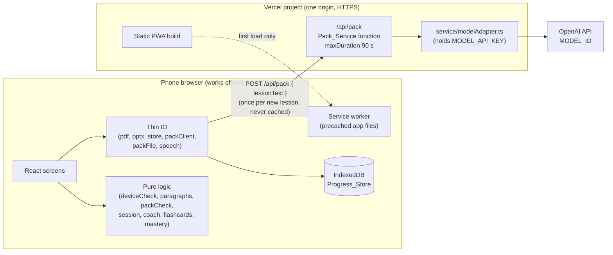
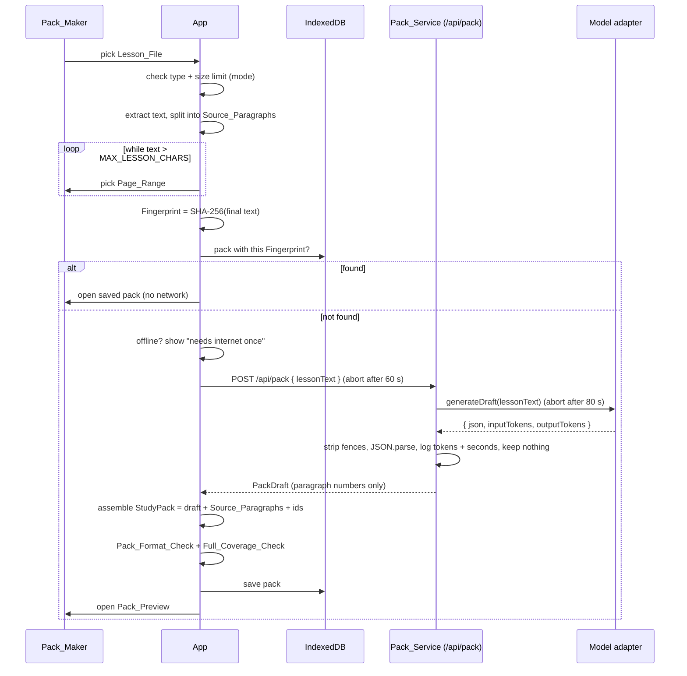

# Design Document

## Overview

[APP NAME] is one small React + Vite + TypeScript PWA plus one Vercel function, both in one Vercel project. A Vercel function is a small piece of server code that Vercel runs only when a request comes in. A PWA (progressive web app) is a website that can be installed and that keeps working offline because a service worker (a small background script) saves the app files on the phone.

The design follows one idea: **all thinking happens in plain TypeScript functions on the phone, except one AI call per lesson.**

- The phone reads the lesson file, splits it into numbered Source_Paragraphs, and computes the Fingerprint.
- The phone sends only the numbered Lesson_Text to the Pack_Service once.
- The Pack_Service (at `/api/pack`) asks a small AI model for a pack *draft*, through one small adapter file. The draft points to paragraphs by number only. It never repeats paragraph text.
- The phone joins the draft with its own Source_Paragraphs to build the saved Study_Pack, checks it, and stores it in IndexedDB (the browser's built-in database).
- From then on, studying, coaching, flashcards, and mastery are pure functions plus IndexedDB. No network.

Scope is kept small for two people with about 10 hours: one Vercel project (web app + one function), no server database, no login service.

### Key design decisions

| Decision | Choice | Why |
|---|---|---|
| Pack_Service endpoint | Vercel function at `/api/pack`, `maxDuration` 90 s | Same origin as the PWA (same address), so no CORS setup is needed and the app calls the relative URL `/api/pack`. 90 s > model-call timeout (80 s) > PACK_TIMEOUT_SECONDS (60 s), so the phone gives up first. |
| Model call | One adapter file (`service/modelAdapter.ts`) calling the OpenAI API | The handler only knows `generateDraft()`. Switching to Amazon Bedrock or a local model later changes only that file and the env vars. |
| API key | `MODEL_API_KEY` read with `process.env` inside the function only | The key never reaches the browser bundle or the phone. |
| Service output | Paragraph numbers only | Smaller, faster AI output, and the AI cannot change the lesson text. The phone already has the text. |
| Logic style | Pure functions with a thin React layer | Pure functions (same input, same output, no side effects) are easy to property-test. |
| Storage | IndexedDB through the `idb` package (about 1 KB) | Small, promise-based, no heavy library. |
| Validation | Hand-written checker, no schema library | Keeps the bundle small; the pack shape is small. |
| Routing | One `screen` state value in the root component | No router library needed for about 10 screens. |
| Hosting | Vercel (static PWA build + one function, one project) | Gives HTTPS, which the service worker and `crypto.subtle` (hashing) both need. One deploy for both parts. |
| PWA tooling | `vite-plugin-pwa` (Workbox precache) | Saves every built file on first load (Req 8.3). `/api/pack` is never cached. |

Research notes (rephrased for compliance with licensing restrictions): with fluid compute turned on (the default for new projects), a Vercel function on the Hobby plan has a default and maximum duration of 300 s, and Pro allows up to 800 s. So `maxDuration: 90` fits every plan ([Vercel: configuring duration](https://vercel.com/docs/functions/configuring-functions/duration), [Vercel: function limits](https://vercel.com/docs/functions/limitations)).

## Architecture



### Making a pack (the only networked flow)



### Project layout

```
app/                       Vercel project root (Root Directory = app)
  vercel.json              maxDuration 90 for api/pack.ts
  api/pack.ts              the Pack_Service function (POST /api/pack)
  service/modelAdapter.ts  the only file that knows the AI provider
  src/config.ts            APP_NAME, PACK_EXTENSION, MAX_LESSON_CHARS,
                           PACK_TIMEOUT_SECONDS, PACK_SERVICE_URL, size limits
  src/logic/               pure, no browser APIs (all property-tested)
    deviceCheck.ts  paragraphs.ts  pageRange.ts  assemble.ts
    packCheck.ts    packJson.ts    session.ts    coach.ts
    flashcards.ts   mastery.ts     fileType.ts
  src/io/                  thin wrappers over browser APIs
    pdf.ts  pptx.ts  fingerprint.ts  packClient.ts
    store.ts  packFile.ts  speech.ts
  src/screens/             React screens
```

The adapter lives in `service/`, not in `api/`, because Vercel turns every file in `api/` into its own public endpoint.

Heavy code (pdf.js, JSZip) is loaded with dynamic `import()` only on the Make Pack screen, so students who only study never parse it on start-up. It is still precached so the app is complete offline.

The service worker precaches only the files in the Vite build output, so `/api/pack` is never in the precache list. The Workbox setting `navigateFallbackDenylist: [/^\/api\//]` makes sure `/api/*` requests always go to the network and never get the cached app page instead. No runtime caching rule is added for `/api/*`. Everything else about offline behavior stays the same.

## Components and Interfaces

### config.ts

```ts
export const APP_NAME = "[APP NAME]";
export const PACK_EXTENSION = ".studypack";
export const MAX_LESSON_CHARS = 30000;
export const PACK_TIMEOUT_SECONDS = 60;
export const PACK_FORMAT_VERSION = 1;
export const SIZE_LIMIT_BYTES = { lite: 5 * 1024 * 1024, standard: 20 * 1024 * 1024 };
export const SESSION_LENGTH = 8;
export const PACK_SERVICE_URL = "/api/pack"; // same origin, relative URL
```

`config.ts` has no browser-only code, so `api/pack.ts` imports `MAX_LESSON_CHARS` from it. There is one copy of the limit.

### Device_Check (`logic/deviceCheck.ts`) — Req 1.1–1.4

```ts
type Mode = "lite" | "standard";
interface DeviceInfo { deviceMemoryGb?: number; saveData?: boolean }
function proposeMode(info: DeviceInfo): Mode;
// lite  if (deviceMemoryGb !== undefined && deviceMemoryGb <= 4) || saveData === true
// standard otherwise (including when both are missing)
function sizeLimit(mode: Mode): number;
function checkSize(bytes: number, mode: Mode):
  { ok: true } | { ok: false; sizeBytes: number; limitBytes: number };
```

The IO side reads `navigator.deviceMemory` and `navigator.connection?.saveData`; either may be missing. Chrome reports `deviceMemory` rounded to a power of two (for example 4 on the Reference_Device), so it shows Lite_Mode there. The First Run screen shows the proposal with two buttons (Req 1.5). Settings has the same switch (Req 1.6).

Lite_Mode sets `data-mode="lite"` on `<html>`. One CSS rule turns off every `animation` and `transition` under it (Req 1.7).

### Importer — Req 1.8–1.9, Req 2

- `logic/fileType.ts`: `detectType(name, firstBytes) -> "pdf" | "pptx" | "unsupported"`. PDF = bytes start with `%PDF-`. PPTX = name ends `.pptx` and bytes start with `PK` (zip).
- Size check runs before reading: `file.size > sizeLimit(mode)` stops with a message showing both sizes in MB.
- `io/pdf.ts`: uses pdf.js to get text items per page. Lines are built from items (`hasEOL`). Returns `RawPage[] = { page: number, lines: string[] }[]`.
- `io/pptx.ts` (optional, built last, Req 2.5): JSZip opens `ppt/slides/slideN.xml`, collects `<a:t>` text per slide. Returns the same `RawPage[]` (one page per slide).
- `logic/paragraphs.ts`: `splitParagraphs(pages: RawPage[]) -> LessonParagraph[]`.
  - A new paragraph starts at an empty line or a page change.
  - Whitespace inside a paragraph is collapsed to single spaces.
  - Empty paragraphs are dropped.
  - A paragraph longer than 800 characters is split at the last sentence end (`. ? !`) before 800, so links point to a small piece of text.
  - Numbers are 1..N in reading order.
- Scanned check (Req 2.3): if total non-space characters < 20, show "scanned files are not supported".
- `logic/pageRange.ts` (Req 3.1): `applyPageRange(paras, first, last)` keeps paragraphs whose page is in range and renumbers them 1..K. `lessonText(paras)` joins `"[n] text"` lines with blank lines; this string is both what we hash and what we send. The screen repeats the Page_Range request while `lessonText(...).length > MAX_LESSON_CHARS`.

### Fingerprint (`io/fingerprint.ts`) — Req 3.2

`fingerprint(text) = hex(SHA-256(UTF-8 text))` with `crypto.subtle.digest`. The Fingerprint is also the pack `id`, so the same lesson gives the same id on every phone. Problem_Flags and mastery are keyed by this id.

### Pack client (`io/packClient.ts`) — Req 3.4, 3.10, 3.11

```ts
type MakeResult =
  | { ok: true; draft: unknown }
  | { ok: false; reason: "offline" | "timeout" | "server" | "bad_json" };
async function requestDraft(lessonText: string): Promise<MakeResult>;
```

- If `navigator.onLine === false`, return `offline` without calling fetch.
- `fetch(PACK_SERVICE_URL, { method: "POST", body: JSON.stringify({ lessonText }), signal })` with an `AbortController` that aborts after `PACK_TIMEOUT_SECONDS`.
- One request per tap. "Try again" makes one new request.

### Assembler (`logic/assemble.ts`) — Req 3.7, 3.8

```ts
function assemblePack(draft: PackDraft, paragraphs: LessonParagraph[], id: string, title: string, createdAt: string): StudyPack;
```

Copies paragraph text from the phone's own `LessonParagraph[]` (dropping `page`), gives each Question a stable id (`q1`, `q2`, … in draft order), and adds `formatVersion`, `id`, `title` (file name without extension), and `createdAt`. It does not validate; the checks run after.

### Pack checks (`logic/packCheck.ts`) — Req 3.9, 4.3, 4.4, 4.6, 4.7

```ts
function formatCheck(x: unknown): { ok: true; pack: StudyPack } | { ok: false; errors: string[] };
function coverageCheck(pack: StudyPack): { ok: boolean; emptySlots: Slot[] };
function emptySlots(pack: StudyPack): Slot[];          // used for Preview warnings
function removeQuestion(pack: StudyPack, id: string):
  { ok: true; pack: StudyPack } | { ok: false; reason: "last_question" };
type Slot = { skill: Skill; level: ReadingLevel };
```

The Pack_Preview calls `removeQuestion`, saves the new pack, and shows a warning for each slot in `emptySlots` (for example "No inference questions at Reading_Level 2").

`formatCheck` rules (the Pack_Format_Check):
1. `formatVersion === 1`, `id`, `title`, `createdAt` are non-empty strings.
2. `paragraphs` is a non-empty array; paragraph `n` values are exactly 1..N in order; each `text` is a non-empty string.
3. `summaries` has exactly 3 items with levels 1, 2, 3 (one each); each has non-empty `text` and a non-empty `paragraphs` number array.
4. `questions` has at least 1 item; ids are unique non-empty strings; `skill` is one of the four Skills; `level` is 1, 2, or 3; `choices` has 2–4 non-empty strings; `answerIndex` is an integer inside `choices`; `hints` has exactly 2 items; `explanation` exists. Every hint and explanation has non-empty `text` and an integer `paragraph`.
5. `glossary` is an array (may be empty); each card has non-empty `en`, `fil`, `meaning`.
6. **Every paragraph number** referenced by a summary, hint, or explanation is an integer between 1 and N (it exists in `paragraphs`).
7. No unknown top-level fields are required; extra fields are dropped so that the returned `pack` has exactly the known shape.

`coverageCheck` (the Full_Coverage_Check) passes when all 12 Coverage_Slots have at least one Question. It runs only on packs from the Pack_Service, never on opened Pack_Files.

### Pack JSON and Pack_File (`logic/packJson.ts`, `io/packFile.ts`) — Req 3.12, 4.5–4.8

```ts
function packToJson(pack: StudyPack): string;            // JSON.stringify
function packFromJson(text: string): ReturnType<typeof formatCheck>; // JSON.parse + formatCheck
```

- Export: `new File([packToJson(pack)], safeName(title) + PACK_EXTENSION, { type: "application/json" })`. If `navigator.canShare({ files })` is true, use the Web Share API (opens Android's share sheet: Messenger, Bluetooth, etc.). Otherwise download the file.
- Import: a file input (`accept` left open, because chat apps often rename or drop the extension), read as text, `packFromJson`. A bad JSON parse or failed check shows "This file is not a valid pack" and saves nothing.
- If a pack with the same `id` already exists, the imported pack replaces it; progress and flags stay because they are keyed by `id`.

### Store (`io/store.ts`) — Req 8.2, 8.5, 8.6

One IndexedDB database named from APP_NAME with four object stores:

| Store | Key | Value |
|---|---|---|
| `packs` | pack `id` | `StudyPack` |
| `mastery` | pack `id` | `MasteryRecord` |
| `flags` | `${packId}:${questionId}` | `true` |
| `settings` | `"mode"` | `Mode` |

`deleteAll()` deletes the whole database, then the app reloads. No `mode` setting means first run, so the Device_Check shows again (Req 8.6).

### Study session (`logic/session.ts`) — Req 5

A pure reducer. A reducer is a function `(state, event) -> newState`.

```ts
type PathKind = "catchup" | "practice";
interface SessionState {
  level: ReadingLevel;            // always 1..3
  answeredIds: string[];          // questions finished this session
  rightStreak: number;            // first-try rights in a row
  wrongStreak: number;            // first-try wrongs in a row
  current: { questionId: string; wrongTries: number } | null;
  done: boolean;
}
function startSession(path: PathKind): SessionState;    // level 1 or 2
function available(pack: StudyPack, s: SessionState, flagged: Set<string>): Question[];
function pickNext(pack, s, flagged): Question | null;
function answer(s: SessionState, q: Question, choice: number): { state: SessionState; feedback: Feedback };
function skipFlagged(s, pack, flagged): SessionState;   // after "report a problem"
```

Rules:
- `pickNext`: Available_Questions at `level`; if none, the nearest level (distance 1, then 2). When levels 1 and 3 tie (current level 2), pick level 1 first, because an easier question is safer for a struggling reader. Inside one level, the first in pack order.
- First answer on a question decides the streaks. Right first try: `rightStreak + 1`, `wrongStreak = 0`. Wrong first try: `wrongStreak + 1`, `rightStreak = 0`.
- `rightStreak === 3`: `level = min(3, level + 1)`, `rightStreak = 0`. `wrongStreak === 2`: `level = max(1, level - 1)`, `wrongStreak = 0`.
- A question is finished when it is answered right, or on the third wrong answer. Then it joins `answeredIds`.
- `done` becomes true when `answeredIds.length === SESSION_LENGTH` (8) or `pickNext` returns null.
- A reported question is skipped: it does not count toward the 8, does not change streaks, and does not change mastery.

The session starts on the Summary screen showing the Lesson_Summary at the starting level (Req 5.4). Session state lives in React memory only; closing the app mid-session drops it. That is fine for the MVP; mastery is saved after every answer.

### Coach (`logic/coach.ts`) — Req 6.1–6.5

```ts
type Feedback =
  | { kind: "hint"; text: string; paragraph: number; hintIndex: 0 | 1 }
  | { kind: "reveal"; correctIndex: number; text: string; paragraph: number }
  | { kind: "praise"; message: string; text: string; paragraph: number };
function coach(q: Question, wrongTriesBefore: number, choice: number): Feedback;
```

Right answer → praise + Explanation. Wrong with 0 earlier wrongs → Hint 1; with 1 → Hint 2; with 2 → reveal Explanation. Every feedback carries a `paragraph`, shown as a "See in lesson ¶n" link that opens a bottom sheet with that paragraph's text (Req 6.5, 6.6). Praise messages come from a small fixed list.

### Problem_Flags — Req 6.8–6.10

"Report a problem" writes `flags[packId:questionId] = true`, then calls `skipFlagged` and `pickNext`. `available()` excludes flagged ids. The Pack_Preview shows a "Reported" tag on flagged questions.

### Flashcards (`logic/flashcards.ts`) — Req 7.1–7.5

```ts
interface FlashState { queue: number[]; flipped: boolean; doneCount: number }
function startFlash(cardCount: number): FlashState;     // queue = [0..n-1]
function flip(s): FlashState;
function gotIt(s): FlashState;                          // drop head, doneCount + 1
function showAgain(s): FlashState;                      // move head back
const isDone = (s) => s.queue.length === 0;
```

`showAgain`: remove the head card; the rest has `r` cards. If `r >= 3`, insert the card at index 3 (after 3 other cards). Otherwise append it at the end. Every move resets `flipped` to false, so the English side shows first. The flashcard button is hidden for a pack with no Glossary_Cards.

### Mastery (`logic/mastery.ts`) — Req 7.6, 7.7

```ts
type MasteryRecord = Record<Skill, { answered: number; firstTryRight: number }>;
function recordAnswer(m: MasteryRecord, skill: Skill, firstTryRight: boolean): MasteryRecord;
function percent(m: MasteryRecord, skill: Skill): number; // 0 when answered = 0, else round(100 * right / answered)
```

Mastery is per Study_Pack and counts every finished question across all sessions (repeats count again). It is saved to IndexedDB when a question is finished. A skill with 0 answers shows "0% · not started yet".

### Read_Aloud (`io/speech.ts`) — Req 5.10–5.12

Uses `speechSynthesis`. Voices load late on Android, so the app waits for the `voiceschanged` event (or 1 s). If `getVoices()` is empty, the button is hidden. It prefers voices with `localService === true`, because those work offline. If speaking fails, it stops quietly (no error popup, Req 8.7). For a Question it reads the prompt then each choice ("A. …, B. …").

### AI_Label — Req 6.7

A `PackHeader` component used by every screen that shows pack content. It always renders "AI-made, check with your teacher".

### Pack_Service (`api/pack.ts`) — Req 3.5, 3.6

- A Node.js Vercel function at `POST /api/pack`, same origin as the PWA, so no CORS config. Other methods get 405.
- **`maxDuration` 90 s**, set in `vercel.json`:
  ```json
  { "functions": { "api/pack.ts": { "maxDuration": 90 } } }
  ```
  Order of time limits: phone 60 s < model call 80 s < function 90 s, so the phone always gives up first.
- Request: `{ lessonText: string }`. Rejects with 400 `{ "error": "bad_request" }` if missing or longer than MAX_LESSON_CHARS.
- Calls `generateDraft(lessonText)` from the adapter. It does not know which AI provider is used.
- Strips code fences, runs `JSON.parse`. Success → 200 with the JSON. Parse failure → 502 `{ "error": "bad_model_output" }`. Adapter error or timeout → 502 `{ "error": "model_failed" }`.
- Keeps nothing: no database, no file writes.
- Logs one line per request: status code, input tokens, output tokens, and seconds taken. It never logs the lesson text or the pack.

### Model adapter (`service/modelAdapter.ts`)

An adapter is a small file that hides which outside service we use behind one simple function.

```ts
interface DraftResult { json: string; inputTokens: number; outputTokens: number }
function generateDraft(lessonText: string): Promise<DraftResult>;
```

- Calls the OpenAI API with plain `fetch` (no SDK, so fewer dependencies), with an `AbortController` timeout of 80 s.
- Env vars: `MODEL_ID` (value `gpt-6-luna`) and `MODEL_API_KEY`. Both are read with `process.env` inside the function only.
- Asks for **JSON-only output** (OpenAI's JSON output mode or structured output) and a **low reasoning effort** (`"low"`) so generation is fast. Output token cap about 8000.
- Token counts come from the `usage` part of the response.
- The fixed prompt asks for the `PackDraft` shape only, **2 Questions per Coverage_Slot (24 total)** so the Pack_Maker can remove bad ones, short sentences, Reading_Level 1 = very simple words, and references by paragraph number only (never paragraph text).
- **To confirm at build time:** we could not check that `gpt-6-luna` exists, or the exact parameter names it supports for JSON output and reasoning effort. Check them against the OpenAI API docs before writing this file.
- **Changing provider later:** to use Amazon Bedrock or a local model instead, rewrite only this file and change the env vars. `api/pack.ts`, the prompt rules, and the app stay the same.

**Keeping the key secret:**
- `MODEL_API_KEY` never has the `VITE_` prefix. Vite only puts `VITE_` variables into the browser bundle, so the key cannot end up on the phone.
- The key is never sent in any response or log.
- The key is set in the Vercel project's environment variables. Local copies live in `.env.local`, and `.gitignore` must list `.env*` so no env file is ever committed. (Today `.gitignore` lists only `.env`; the setup task widens it.)

**Security note:** `/api/pack` has no login, because the product has no accounts. Anyone who finds the URL could call it with a script. Mitigations: the input length cap, browser use only from our own origin (this does not stop scripts), the API key never leaving the server, Vercel's own function limits, and (suggested) a spend limit and budget alert on the OpenAI project. This is fine for a demo. A real launch would need rate limiting or an app key.

## Data Models

```ts
type Skill = "main_idea" | "detail" | "vocabulary" | "inference";
type ReadingLevel = 1 | 2 | 3;

// Importer output (phone only, never saved as-is)
interface LessonParagraph { n: number; text: string; page: number }

// ---- What the Pack_Service returns (no paragraph text, no ids) ----
interface PackDraft {
  summaries: { level: ReadingLevel; text: string; paragraphs: number[] }[];
  questions: {
    skill: Skill;
    level: ReadingLevel;
    prompt: string;
    choices: string[];          // 2-4
    answerIndex: number;
    hints: [Ref, Ref];          // exactly 2
    explanation: Ref;           // correct answer + short reason
  }[];
  glossary: { en: string; fil: string; meaning: string }[];
}
interface Ref { text: string; paragraph: number }   // paragraph NUMBER only

// ---- What the App saves and shares (Pack_File content) ----
interface StudyPack {
  formatVersion: 1;
  id: string;                   // Fingerprint (SHA-256 hex)
  title: string;
  createdAt: string;            // ISO date string (not a Date, so JSON round-trips)
  paragraphs: { n: number; text: string }[];   // attached by the App
  summaries: PackDraft["summaries"];
  questions: (PackDraft["questions"][number] & { id: string })[];
  glossary: PackDraft["glossary"];
}

// ---- On-phone progress ----
type MasteryRecord = Record<Skill, { answered: number; firstTryRight: number }>;
type Mode = "lite" | "standard";
```

The two schemas differ on purpose: `PackDraft` is what the AI writes, `StudyPack` is what the phone trusts after `formatCheck`. All fields are JSON-safe (strings, numbers, booleans, arrays, plain objects; no `undefined`, no `Date`), so `JSON.parse(JSON.stringify(pack))` is deep-equal to `pack`.

A Pack_File is the UTF-8 JSON text of one `StudyPack`, named `<title><PACK_EXTENSION>`.

## Correctness Properties

*A property is a characteristic or behavior that should hold true across all valid executions of a system-essentially, a formal statement about what the system should do. Properties serve as the bridge between human-readable specifications and machine-verifiable correctness guarantees.*

All properties below test pure functions in `app/src/logic/`, so each one runs fast in memory. Similar criteria were merged so that each property checks something new.

### Property 1: Device_Check mode proposal

*For any* `DeviceInfo` (memory is a positive number or missing; saveData is true, false, or missing), `proposeMode` returns `"lite"` exactly when memory is present and ≤ 4 or saveData is true, and returns `"standard"` otherwise (including when both are missing).

**Validates: Requirements 1.2, 1.3, 1.4**

### Property 2: Import size limit

*For any* file size in bytes and any mode, `checkSize` accepts exactly when size ≤ the mode's limit (5 MB Lite, 20 MB Standard), and every rejection carries the same size and limit that were checked.

**Validates: Requirements 1.8, 1.9**

### Property 3: File type detection

*For any* file name and leading bytes, `detectType` returns `"pdf"` exactly when the bytes start with `%PDF-`, `"pptx"` exactly when the name ends in `.pptx` (any case) and the bytes start with `PK` and are not a PDF, and `"unsupported"` otherwise.

**Validates: Requirements 2.4**

### Property 4: Paragraph split keeps all text, in order, numbered 1..N

*For any* list of pages of text lines, `splitParagraphs` returns paragraphs numbered exactly 1..N in order, none empty, each at most 800 characters unless it has no sentence end before 800, and joining all paragraph texts gives the same non-whitespace characters, in the same order, as the input.

**Validates: Requirements 2.2**

### Property 5: Page_Range filter and renumber

*For any* paragraph list and any page range first ≤ last, `applyPageRange` returns exactly the paragraphs whose page is in the range, keeps their order and text, and numbers them 1..K.

**Validates: Requirements 3.1**

### Property 6: Assembled pack passes the check and uses the phone's own text

*For any* paragraph list and any valid `PackDraft` whose paragraph references all fall in 1..N, `formatCheck(assemblePack(...))` succeeds; the pack's `paragraphs[i].text` equals the Importer's paragraph `i` text; every Question has a unique id; and every Question has 2 Hints and 1 Explanation.

**Validates: Requirements 3.7, 3.8**

### Property 7: Dangling paragraph references are rejected

*For any* valid StudyPack, changing any one summary, Hint, or Explanation paragraph reference to a number outside 1..N (or a non-integer) makes `formatCheck` fail.

**Validates: Requirements 3.8, 4.7**

### Property 8: Invalid input never becomes a pack

*For any* string (random text, random JSON, or a valid pack with one required field removed or set to the wrong type), `packFromJson` returns a result without throwing, and returns `ok: false` whenever the input is not a valid pack.

**Validates: Requirements 4.7, 3.10**

### Property 9: JSON and Pack_File round trip

*For any* StudyPack that passes `formatCheck` (with full coverage or with empty Coverage_Slots, and with paragraph and glossary text including Filipino letters, emoji, quotes, and newlines), `packFromJson(packToJson(pack))` succeeds and is deep-equal to the original pack.

**Validates: Requirements 3.12, 4.6, 4.8**

### Property 10: Coverage slots and warnings

*For any* StudyPack, `emptySlots` returns exactly the (Skill, Reading_Level) pairs out of the 12 that have no Question, and `coverageCheck` passes exactly when that list is empty.

**Validates: Requirements 3.9, 4.4**

### Property 11: Removing a Question

*For any* StudyPack and any Question id in it: if the pack has 2 or more Questions, `removeQuestion` returns a pack with that id gone, one fewer Question, and all other Questions and fields unchanged; if the pack has exactly 1 Question, it returns `last_question` and the pack is unchanged.

**Validates: Requirements 4.2, 4.3**

### Property 12: Next Question is available and at the nearest level

*For any* StudyPack, set of Problem_Flags, set of already-answered ids, and current Reading_Level, `pickNext` returns null exactly when no Available_Question exists; otherwise it returns a Question that is not flagged and not answered, and no Available_Question has a smaller distance from the current Reading_Level.

**Validates: Requirements 5.5, 6.9**

### Property 13: Reading_Level adapts and stays in 1..3

*For any* start Path and any sequence of first-try results (right or wrong), the session reducer's Reading_Level equals a simple model: start at 1 (Catch-up) or 2 (Practice), go up 1 (max 3) after 3 first-try rights in a row, go down 1 (min 1) after 2 first-try wrongs in a row, with streaks resetting after each change. The level is always 1, 2, or 3.

**Validates: Requirements 5.2, 5.3, 5.6, 5.7, 5.8**

### Property 14: Session ends at 8 or when nothing is left

*For any* StudyPack, flags, Path, and sequence of answers, no Question is finished twice in a session, the finished count never exceeds 8, and the session is `done` exactly when 8 Questions are finished or no Available_Question remains.

**Validates: Requirements 5.9**

### Property 15: Coach feedback ladder

*For any* Question, number of earlier wrong tries (0, 1, or 2), and chosen answer: a correct choice gives praise with the Explanation; a wrong choice gives Hint 1 after 0 earlier wrongs, Hint 2 after 1, and the Explanation with the correct answer after 2. The feedback's paragraph number always equals the paragraph of the Hint or Explanation shown.

**Validates: Requirements 6.1, 6.2, 6.3, 6.4, 6.5**

### Property 16: "Show again" placement

*For any* non-empty flashcard queue, `showAgain` moves the front card to index 3 of the remaining queue when 3 or more cards remain, or to the end when fewer remain; the other cards keep their order, the set of cards is unchanged, and the card shows its English side.

**Validates: Requirements 7.1, 7.4**

### Property 17: Flashcard session completes with the right count

*For any* number of cards and any sequence of "got it" / "show again" actions, "got it" removes exactly the front card, and when the queue becomes empty `doneCount` equals the number of Glossary_Cards.

**Validates: Requirements 7.3, 7.5**

### Property 18: Mastery percent matches the answer history

*For any* list of (Skill, firstTryRight) answers, folding `recordAnswer` over the list gives counts equal to a direct count per Skill, and `percent` for each Skill is 0 when there are no answers and otherwise `round(100 × right / answered)`, always between 0 and 100.

**Validates: Requirements 7.6, 7.7**

## Error Handling

Every error shows a short, friendly message in plain words. Nothing half-done is saved.

| Situation | Where caught | What the user sees | Saved? |
|---|---|---|---|
| File over mode limit | `checkSize` before reading | "This file is 8.2 MB. The limit in Lite mode is 5 MB." | No |
| Not PDF/PPTX | `detectType` | "Please pick a PDF or PPTX file." | No |
| Scanned PDF (no text) | after extract | "This looks like a scanned file. Scanned files are not supported yet." | No |
| pdf.js / JSZip throws (broken file) | try/catch in `io/` | "We could not read this file." | No |
| Text too long | length check | Page_Range picker with "Still too long, pick fewer pages." | No |
| Offline when a new pack is needed | `requestDraft` | "Making a pack needs internet once." | No |
| No answer in 60 s | `AbortController` | "This is taking too long." + Try again | No |
| HTTP error / network error | `requestDraft` | "Something went wrong." + Try again | No |
| Draft fails Pack_Format_Check or Full_Coverage_Check | `formatCheck` / `coverageCheck` | "The pack did not come out right." + Try again | No |
| Removing the last Question | `removeQuestion` | "A pack needs at least 1 question." | Unchanged |
| Bad Pack_File | `packFromJson` | "This file is not a valid pack." | No |
| No speech voice | `speech.ts` | Read_Aloud button hidden | — |
| Speech fails mid-way | `speech.ts` | Stops quietly | — |
| IndexedDB write fails (storage full) | `store.ts` | "Your phone storage is full." | No |
| Missing paragraph number at display time | cannot happen after `formatCheck`; link hidden as a guard | — | — |

The function never returns lesson text in errors. It returns only `{ "error": "<code>" }` with status 400, 405, or 502. The model call stops at 80 s and the function at 90 s, both after the phone has already given up at 60 s.

## Testing Strategy

### Tools

- **Vitest** for unit tests (fits Vite, no extra config). Run with `npx vitest --run`.
- **fast-check** for property-based tests. Property-based testing means the library generates many random inputs and checks that a rule always holds.
- Exact versions are pinned in `package.json` at install time.

### Property tests

- One fast-check test per property above (18 tests), in `app/src/logic/*.test.ts`.
- Each test runs at least 100 runs: `fc.assert(fc.property(...), { numRuns: 100 })`.
- Each test has a tag comment in this format:
  `// Feature: study-coach-mvp, Property 9: JSON and Pack_File round trip`
- Shared generators live in `app/src/logic/testGen.ts`: `arbParagraphs`, `arbPackDraft(n)` (references always in 1..n), `arbStudyPack` (via `assemblePack`, then random Question removal so partial-coverage packs are included), `arbDeviceInfo`, `arbAnswerSeq`. Text generators include Filipino letters (ñ), emoji, quotes, and newlines.

### Unit (example) tests

Kept few, for things that do not vary much with input:
- `startSession("catchup").level === 1`, `startSession("practice").level === 2`.
- `proposeMode({}) === "standard"`.
- Scanned check on empty pages.
- Pack file name ends with `PACK_EXTENSION`.
- Pack flow with a mocked client and store: Fingerprint match opens the saved pack and never calls the service; no match calls it exactly once; timeout, HTTP error, and bad draft save nothing.
- `api/pack.ts` handler with a mocked adapter: valid JSON → 200; fenced JSON → 200; garbage → 502; adapter throws → 502; text over MAX_LESSON_CHARS → 400; the log line has status, token counts, and seconds, and never the lesson text.

### Integration and device checks (manual, about 30 minutes)

- One live call to the deployed `/api/pack` with a real sample PDF; record the time (must be under 60 s) and check the Vercel log shows token counts and seconds but no lesson text.
- In the deployed app, search the built JS files for the key: it must not be there.
- Offline: load the app once, turn on airplane mode, reload, and open a saved pack.
- **Reference_Device run (Req 8.7)**: Realme C25s, Chrome, Lite_Mode, airplane mode. Open pack → pick Path → read summary → answer 8 questions (get hints and a reveal) → open a Source_Paragraph → Read_Aloud → flashcards to the end → Mastery_Bars. Pass = no error messages.
- Share a Pack_File to a second phone through Messenger or Bluetooth and open it there.

### Not tested automatically

Screen layout, AI_Label visibility, Lite_Mode animation removal, and the confirm dialogs are checked by eye during the device run. Full WCAG accessibility checking would need manual testing with assistive tools; we only check basic things (button labels, text size, contrast) by hand.
